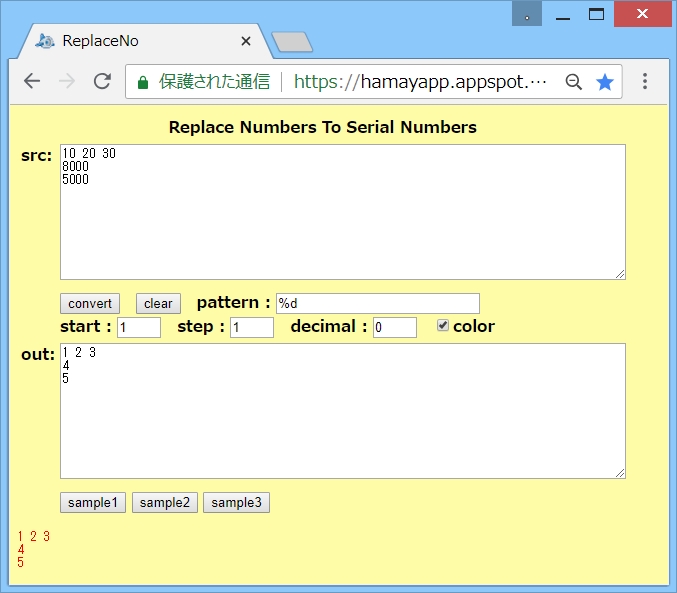

# ReplaceNo

## 概要
- テキスト内の複数の数値を、連番に変換するHTMLです。

- 実行例は、以下のページにあります。  
  https://hamayapp.appspot.com/static/replaceno.html

## 使い方
- replaceno.html を ブラウザで開くと起動します。

- src のテキストボックスにテキストデータを貼り付けて、  
  convert ボタンをクリックすると、変換を実行します。  
  結果は、out のテキストボックスに表示されます。  
  また、その下には置換部分に色を付けた結果も表示されます。

- pattern のテキストボックスには、変換したい部分にマッチするパターン文字列を入力します。  
  パターン文字列内では、以下のコマンドを使用できます。
  
  |
コマンド
|
機能
|
  |---|---|
  |%^ |行頭にマッチします                           |
  |%$ |行末にマッチします                           |
  |%s |空白またはタブにマッチします                 |
  |%t |タブにマッチします                           |
  |%d |数値(例えば 123 や -1.23e-1 等)にマッチします|
  
  パターン文字列内の %d の部分のみが連番に置換されます。  
  (パターン文字列内で % 文字自身を表したい場合は、%% と記述してください)

- start のテキストボックスには、連番の初期値を入力します。  
  step のテキストボックスには、連番の増分を入力します。  
  decimal のテキストボックスには、連番の小数部の表示桁数を入力します。

- また、color のチェックボックスのチェックを外すと、画面下部の表示で、色を付けなくなります。

- clearボタンをクリックすると、入出力をすべてクリアします。

- sample1-3ボタンをクリックすると、変換の例を表示します。

- 変換を実行しても変化がなかった場合には [ no change ] と表示します。

## 注意事項
1. start や step に大きな数(例えば 1e+21 等)を指定すると、うまく変換できないケースがあります。

2. start や step に小数を指定すると、変換結果に誤差が発生するケースがあります。

3. 連番の文字列化には、Number.prototype.toFixed() 関数を使用しています。  
   このため、変換可能な decimal の値の範囲は、この関数の仕様に従います。

## 環境等
- OS
  - Windows 8.1 (64bit)
- ブラウザ
  - Chrome v67

## 履歴
- 2018-6-26  v1.00 (初版)
- 2018-6-26  v1.01 HTML出力のサニタイズ(タグ無効化)処理修正等
- 2018-6-27  v1.02 コメント修正のみ
- 2018-6-27  v1.03 HTML出力見直し(IE8対策)、エラーチェック追加
- 2018-6-30  v1.04 HTML見直し

(2018-6-30)
